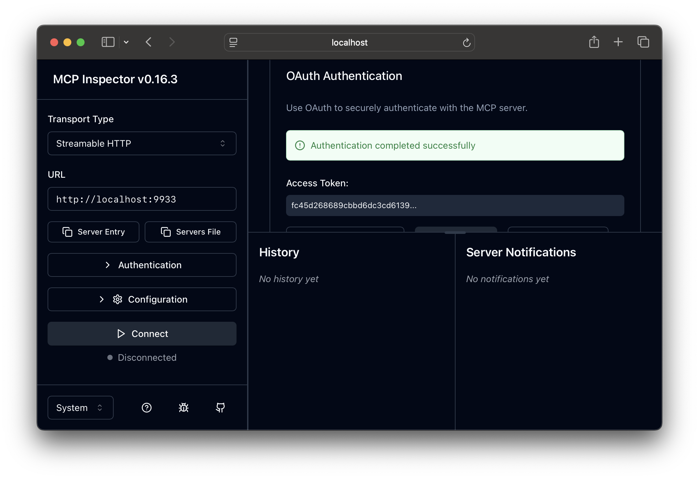
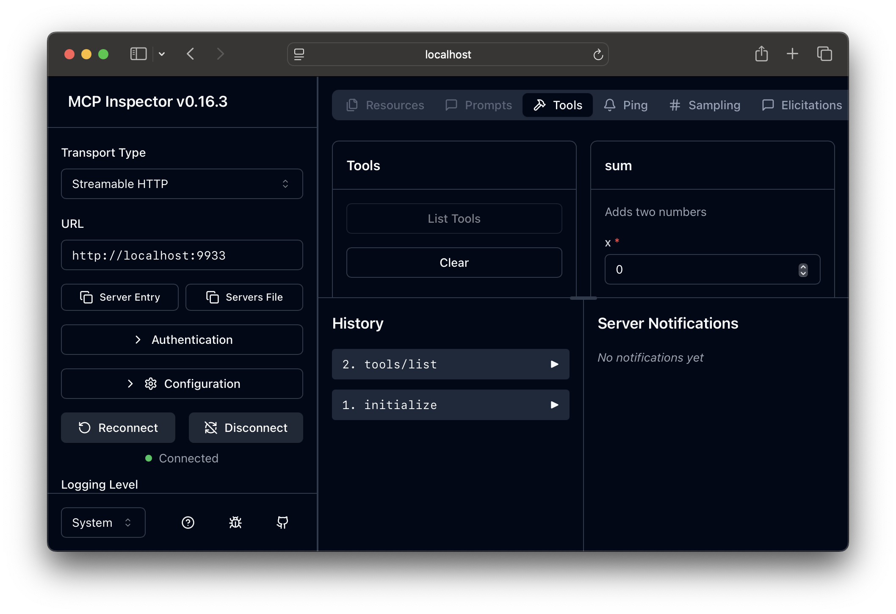

# MCP Server Example

The code in this directory provides a working example of using tsidp with an MCP server that requires authentication. To run this example you’ll need to do the following:

## 1) Ensure tsidp is running or start it

If running via docker, it should look like this:

```bash
docker run -d \
  --name tsidp \
  -p 443:443 \
  -e TS_AUTHKEY=YOUR_TAILSCALE_AUTHKEY \
  -e TSNET_FORCE_LOGIN=1
  -e TAILSCALE_USE_WIP_CODE=1 \
  -v tsidp-data:/var/lib/tsidp \
  tsidp --hostname=idp --dir=/var/lib/tsidp
```

## 2) Update the ACL rules on your tailnet

MCP requires the use of resource indicators, so you’ll also need to add an [ACL application grant](https://tailscale.com/kb/1537/grants-app-capabilities) rule to your tailnet that allows a given user and / or device the ability to specify resources in their request. The following rule is extra permissive for this demo, but it allows anyone from any device on the tailnet to exchange tokens to request any resource. If you’d like to make it more specific, you can change `“*”` in resources to `http://localhost:9933`.

```json
{
  "src": ["*"],
  "dst": ["*"],
  "app": {
    "tailscale.com/cap/tsidp": [
      {
        "users":     ["*"],
        "resources": ["*"],
      },
    ],
  },
},
```

## 3) Start the MCP server example

In a new terminal run the MCP server using the following command. It should start on `localhost` port `9933`.

```bash
go run ./mcp-server.go --tsidp idp.YOUR_TAILNET.ts.net
```

## 4) Start the MCP inspector

To test the server we’ll use the MCP inspector provided directly by the MCP project. As of 2025/09/13, there appears to be a bug in the latest version of the inspector, so we’ll use an earlier version.

```bash
npx @modelcontextprotocol/inspector@0.16.3
```

## 5) Go through the authorization flow

1. Change the transport type to `Streamable HTTP`
2. Update the URL to `http://localhost:9933`
3. Click on `Open Auth Settings`
4. Click on `Quick OAuth Flow` and you should see all green checks.



## 6) Connect to the server and make a tool call

1. Click `Connect`
2. Click `List tools`
3. Call a tool


